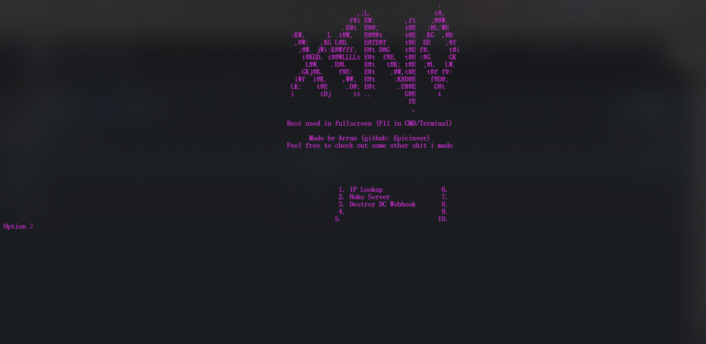

# XENO TOOL
powerful python tool for windows

# Linux/Mac support
This will likely never happen due to most functions being either Windows only or not very functional on Linux/Mac.
Who knows though?

# OPTIONS 

## IP Lookup
### uses ipapi.com to track IPs down

## Server Nuker
### uses older modified leaked version of msc that runs suprisingly well

## Webhook Diddler
### spams everyone and here pings through a webhook

# PULL REQUESTS/ISSUES

Feel free to experiment with Xeno if you want. If you find any bugs, make an issue for it!
If you have a idea for an option, feel free to make a pull request with a concept of how to implement it.
If you have a idea for an option, but don't have a concept, just make a pull request without a concept.

Bugs are very common in Xeno, so if you experience any, please report them!!

# INSTALL

## install.bat
Installs all neccessary libraries and stuff.

## run.bat
Runs Xeno. install.bat should auto open this, but after first use, please always use run.bat, not install.bat.

# DELETE
Run "pip uninstall -r requirement.txt" in the Xeno directory in your terminal.
Then delete Xeno's folder via GUI/terminal.

# Xeno menu

</img>
